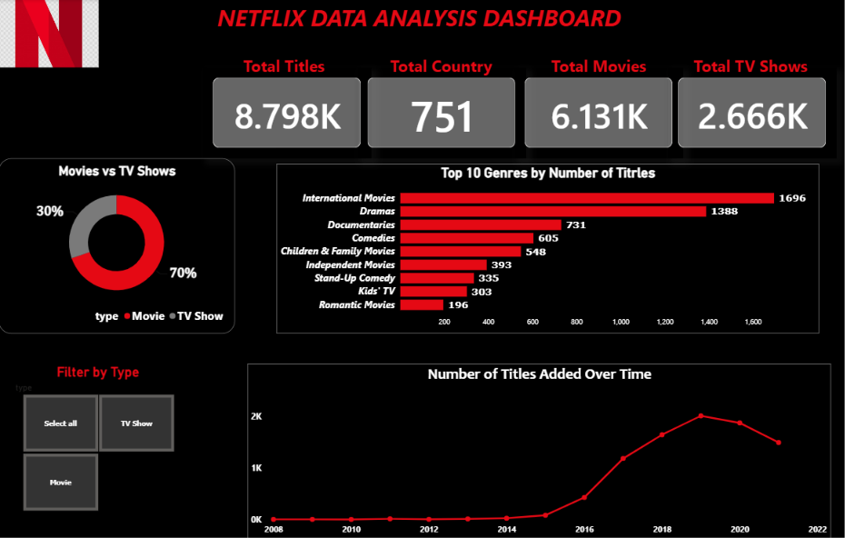

# 🎬 Netflix Data Analysis

## 📌 Project Overview

This project analyzes the **Netflix Movies and TV Shows dataset** to understand the content available on Netflix and identify meaningful trends and patterns.

The analysis focuses on content type, genres, ratings, countries, release years, content additions, and duration.

The project includes **data cleaning, preprocessing, exploratory data analysis (EDA), and data visualization** using Python.

---

## 🎯 Project Objectives

The main objectives of this project are:

* To analyze the distribution of Movies and TV Shows available on Netflix.
* To examine content trends based on release years and the dates when titles were added.
* To identify the most common genres, content ratings, and producing countries.
* To analyze the duration of Movies and TV Shows.
* To compare Movies and TV Shows across ratings, countries, genres, and years.
* To derive meaningful insights from the Netflix content library through data analysis and visualization.

---

## 📂 Dataset

The project uses the **Netflix Movies and TV Shows dataset**.

The dataset contains **8,807 records and 12 columns**.

### Main Columns

| Column         | Description                                 |
| -------------- | ------------------------------------------- |
| `show_id`      | Unique identifier for each title            |
| `type`         | Movie or TV Show                            |
| `title`        | Name of the title                           |
| `director`     | Director of the title                       |
| `cast`         | Cast members                                |
| `country`      | Country associated with the title           |
| `date_added`   | Date when the title was added to Netflix    |
| `release_year` | Original release year                       |
| `rating`       | Content rating                              |
| `duration`     | Movie duration or number of TV Show seasons |
| `listed_in`    | Genre/category                              |
| `description`  | Description of the title                    |

---

## 🛠️ Technologies Used

* **Python**
* **Pandas**
* **NumPy**
* **Matplotlib**
* **Seaborn**
* **Jupyter Notebook**

---

## 🔄 Project Workflow

```text
Raw Dataset
     ↓
Data Inspection
     ↓
Data Cleaning & Preprocessing
     ↓
Exploratory Data Analysis (EDA)
     ↓
Univariate Analysis
     ↓
Bivariate Analysis
     ↓
Data Visualization
     ↓
Key Insights & Conclusion
```

---

## 🧹 Data Cleaning & Preprocessing

The following data cleaning steps were performed:

* Removed the unnecessary `description` column.
* Handled missing values in `country`, `director`, and `cast`.
* Removed records with missing `date_added`.
* Corrected misplaced movie duration values found in the `rating` column.
* Handled invalid and missing rating values.
* Renamed columns for better readability:

  * `listed_in` → `genres`
  * `date_added` → `added_date`
* Removed leading and trailing whitespaces from date values.
* Converted `added_date` from string to datetime format.
* Checked for duplicate records.

After preprocessing, the dataset was ready for Exploratory Data Analysis.

---

# 📊 Exploratory Data Analysis

## 1. Movies vs TV Shows Distribution

Analyzed the distribution of Movies and TV Shows in the Netflix dataset.

**Key Insight:** Movies make up the majority of Netflix's content compared with TV Shows.

---

## 2. Content Added Over the Years

Analyzed the number of titles added to Netflix each year.

**Key Insight:**

* Content additions were relatively low in the early years.
* Content additions increased significantly after 2015.
* **2019 recorded the highest number of content additions with 2,016 titles.**
* Content additions decreased slightly after 2019 but remained substantially higher than earlier years.

---

## 3. Content Release Year Analysis

Analyzed the original release years of Netflix titles.

**Key Insights:**

* The dataset contains titles released from **1925 to 2021**.
* Most content was released after 2000.
* **2018 had the highest number of titles released, with 1,146 titles.**

---

## 4. Most Common Genres

Analyzed the most common genres available on Netflix.

Since a single title can belong to multiple genres, the genre column was split into separate rows using `explode()` for accurate analysis.

**Key Insights:**

* **International Movies** was the most common genre.
* **Dramas** and **Comedies** were also among the most common genres.
* Movies were represented across a wider variety of genres than TV Shows.

---

## 5. Content Rating Distribution

Analyzed the distribution of Netflix titles across different content ratings.

**Key Insights:**

* **TV-MA** was the most common rating.
* **TV-14** and **TV-PG** were also among the most common ratings.
* Movies dominated ratings such as PG, PG-13, R, and NC-17.
* TV Shows were more concentrated in TV-specific rating categories.

---

## 6. Content Distribution by Country

Analyzed Netflix content based on country.

Because some titles are associated with multiple countries, the country column was split into separate rows for analysis.

**Key Insights:**

* The **United States** had the highest number of titles.
* **India** ranked second.
* The **United Kingdom** had a relatively balanced distribution of Movies and TV Shows.
* Japan and South Korea had a stronger representation of TV Shows compared with Movies.

---

## 7. Content Duration Analysis

### 🎬 Movie Duration

Analyzed the distribution of movie durations.

**Key Insights:**

* The average movie duration was around **100 minutes**.
* Most movies had durations between approximately **87 and 114 minutes**.
* The dataset contained movies ranging from very short to more than five hours.

### 📺 TV Show Seasons

Analyzed the number of seasons of TV Shows.

**Key Insight:**

* Most TV Shows had **one or two seasons**, indicating that shorter series were common in the dataset.

---

# 📈 Bivariate Analysis

Bivariate analysis was performed to understand relationships between two variables.

### 1. Rating vs Type

Compared Movies and TV Shows across different content ratings.

**Key Insight:** Movies dominated most content ratings, while TV Shows were mainly concentrated in TV-related ratings.

### 2. Country vs Type

Compared the distribution of Movies and TV Shows across countries.

**Key Insight:** The United States and India had a strong Movie presence, while countries such as Japan and South Korea had relatively more TV Shows.

### 3. Genre vs Type

Compared Movies and TV Shows across the top genres.

**Key Insight:** Movies dominated most major genres, while TV Shows were more concentrated in TV-specific genres.

### 4. Added Year vs Type

Analyzed how Movies and TV Shows were added to Netflix over the years.

**Key Insight:**

* Content additions increased significantly after 2015.
* 2019 recorded the highest number of additions.
* Movies were consistently added in greater numbers than TV Shows.

### 5. Rating vs Average Movie Duration

Compared the average movie duration across content ratings.

**Key Insight:**

* Average movie duration varied across ratings.
* Popular ratings such as TV-14, PG-13, and R generally had movie durations above 100 minutes.
* Children's ratings generally had shorter average movie durations.

---

# 💡 Key Insights

1. Movies dominate Netflix's content catalog.
2. The United States is the largest content-producing country, followed by India.
3. Netflix's content library expanded rapidly after 2015.
4. **2019 was the year with the highest number of content additions.**
5. International Movies, Dramas, and Comedies are among the most common genres.
6. TV-MA is the most common content rating, followed by TV-14 and TV-PG.
7. Movies are represented across a wider variety of genres and ratings than TV Shows.
8. Most movies have a duration of around 100 minutes.
9. Most TV Shows have one or two seasons.
10. Overall, Netflix's catalog contains a diverse collection of modern Movies and TV Shows across countries, genres, ratings, and release years.

---

# 🏁 Conclusion

This project explored the Netflix Movies and TV Shows dataset using Python to identify patterns and trends in Netflix's content library.

The analysis shows that **Movies make up the majority of Netflix's catalog**, while the content library experienced significant growth after 2015. The **United States and India** are major contributors to the catalog, while **TV-MA** is the most common content rating.

The project demonstrates practical skills in **data cleaning, preprocessing, exploratory data analysis, data visualization, and extracting meaningful insights from real-world data**.

---

# 🚀 How to Run the Project

1. Clone this repository.
2. Install the required Python libraries.
3. Open `netflix project.ipynb` in Jupyter Notebook.
4. Update the dataset path if required.
5. Run the notebook cells sequentially.

### Install Required Libraries

```bash
pip install pandas numpy matplotlib seaborn jupyter
```

---

# 📁 Project Structure

```text
Netflix-Data-Analysis/
│
├── netflix project.ipynb
├── netflix_titles.csv
├── README.md
└── cleaned_netflix_data.csv
```

---

## Dashboard


# 👩‍💻 Author

**Komal Agarwal**

Data Analytics Project
Python • Pandas • Data Visualization • Exploratory Data Analysis


## Dashboard


